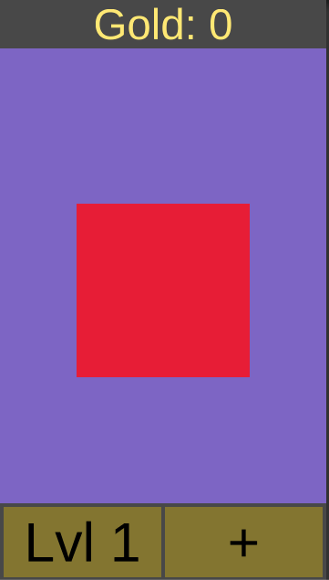
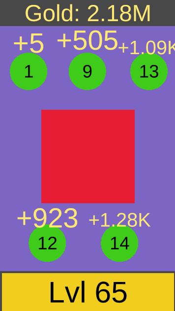

# Circles vs Blocks

Unity version: 2018.4.0f1

# App

[Link to apk](https://drive.google.com/file/d/1eqTu5c_5z-vFlHDqVckAPkP_ctcTJ2mO/view?usp=sharing)

* Clicking on the red square in the middle of the screen gives gold
* Current gold ammount is displayed on the top of the screen
* There are 2 buttons on the bottom panel, left one is for upgrading your level and right one is for purchasing helpers (circles).
After 5 circles have been purchased, the right button will disappear. The buttons are only active if a purchase can be made.
* After purchasing a helper, it will appear on the screen. It displays its level and clicking on the helper will upgrade its level
if enough gold has been gathered.
* Whenever a purchase is made or some resources are earned, a text element appears on the screen and shows the ammount.
* Since numbers can get quite high, for more pleasant display a truncated version of the number is used, for example 1000000 is 
displayed as 1M.
* Scaling coefficients are downloaded and parsed from a file in my google drive, if the file can not be reached for some reason, the app
will not go past "Loading..." screen. However, it is possible to enable debug mode in the editor and not rely on loading this file.
* I used this [generated color pallete.](http://paletton.com/#uid=75z1w0krZuehqDamtvNuGozzjjr) I based it on keeping the block red and using a yellow shade for gold text, but not enrirely happy with the turnout, maybe the colors should be softer.

# Scene layout
- **Canvas**
  - **Resource view**: top panel displaying gold ammount
  - **Upgrade view**: bottom panel showing 2 buttons for leveling up and purchasing a helper
  
- **Block**: The block in the middle of the screen. Has a simple `Enemy` script attatched to it.

- **Circle places**: contains 5 transforms that mark where the helpers should be created. Not the best idea to keep dormant objects in the scene that are not used after initialization, but not a big problem for a game this scale.

- **Controllers**
  - **GameController**: Monst game controlling scripts are attatched to this object. No particular reason for using one object.
  - **TextEffectController**: Parent and controller for a pool of the text effects whenever a purchase, attack or an upgrade is done.

# File layout
Scripts
- Behaviours
  - `Character.cs`: Base class for `Player` and `Circle` and just contains a private field `_level`. If more stats could be associated with player and character, they can be put here.
  - `Circle.cs`: Exposes click and attack evets. Handles auto-attacking for himself, but if there were more circles this loop could be moved out to `CirclesController`
  - `CirclePositions.cs`: Builds and exposes a list of positions based on its children.
  - `Enemy.cs`: Exposes click event for enemy (also handles tweening for himself).
  - `GoldEffectParticle.cs`: Script for the text effect particle. Need to be initialized before used. Used by calling `Launch(...)`.
  - `Player.cs`: Just holds the players level.
  
- Controlles
  - `CirclesController.cs`: Handles creating circles and issuing events when a circle is clicked or it attacks. Has an update loop that manages the purchase button.
  - `FormulaController.cs`: Place where the gold gain and upgrade cost for level is computed. Each class that needs to compute these has a dependency to it. Coefficients will be downloaded from the given url, however `isDebugging` can be enabled and custom settings given in the editor will be used. When setup file is loaded, an event is issued to let the `GameController` know that the game can start.
  - `GameController.cs`: Cotanins the main loop of the game. So it has dependencies on `Player`, `Enemy`, `ResourcesController` and `FormulaController` so that when an enemy is clicked the resources are updated based on player level and the formulas. It also handles a view for the upgrade, since that upgrade increases the player level.
  - `ResourcesController.cs`: Basically stored the gold ammount and updates the `Resource view` when gold ammount is updated. Ps. not entirely happy with this class, because the gold ammount is set in other classes, so it's bug prone. Would rather use something like observer pattern here.
  - `TextEffectController.cs`: Maintains a stack of `GoldEffectParticle`'s. Here observer pattern is used, so `GameController` and `CorclesController` are injected and this controller subscribes to appropriate events from those classes to launch text effect particles. This way other controllers are not poluted with effects code.
  
- Helpers
  - `NumberFormatter.cs`: A pure C# class that exposes static methods to format large numbers. The format is stored inside the class, but going forward would probably require the format to be provided externally.
  
- Settings : Some ScriptableObject classes to store setups
  - `CirclesSetup.cs`: Used in `CriclesController` to store the prototype and parameters for creating helpers.
  - `TextEffectSetup.cs`: Used in `TextEffectController` to set particle effect parameters.
  
- Views
  - `ResourceView.cs`: Exposes a method to set the text in gold display. Format can be set in the editor.
  - `UpgradeView.cs`: Exposes event for button clicks and setting the level text on the button.
